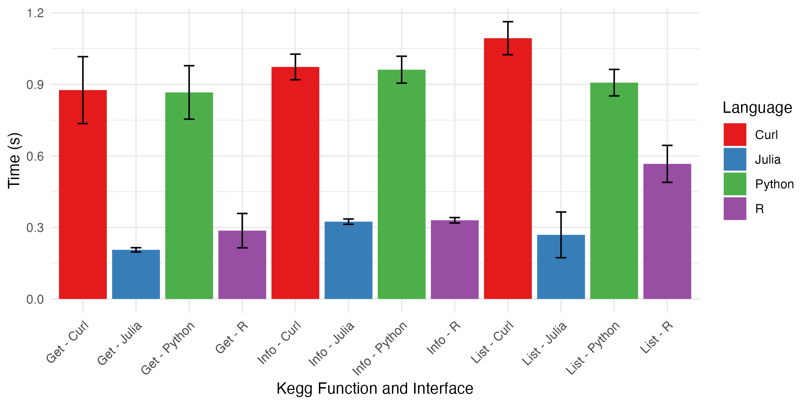

# KEGGAPI.jl

KEGGAPI.jl is a Julia package for accesing the Kyoto Encyclopedia of Genes and Genomes, striving to take advantage of the speed and flexibility that Julia offers and make it accessible to the bioinformatics and functional annotation communities.

## Examples

Examples can be found in the `examples` folder; `example01` provides a comprehensive demonstration of the functions contained in this package.

Example use cases can also be found as colab notebooks: `case01.ipynb`, `case02.ipynb`, `case03.ipynb` show a sample workflow.

## Speed Tests

## Citation

_publication pending_
